Telco Customer Churn Analysis – Full Project
1 Introduction

The purpose of this project is to analyze the customer data of a telecom company to understand why customers churn (leave the service).
This analysis will help the company improve customer retention strategies and identify patterns that predict churn.

2 Problem Definition

The company is experiencing a high churn rate.
Main problem: Identify the factors that lead customers to leave the service.
Sub-problems / goals:

Clean the dataset and handle missing values.

Explore the data with visualizations (EDA).

Analyze class balance (churn vs no churn).

Generate statistical summaries to support decision-making.

3 Step-by-Step Analysis

## 1 Importing Libraries

Calling the libraries needed for data analysis and visualization.
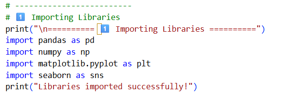

**Interpretation:** These libraries are essential for handling data, cleaning it, performing statistical analysis, and creating plots.

---

## 2 Reading Excel File and Converting to CSV

Reading the Excel file and converting it to CSV to make it easier to work with in our code.
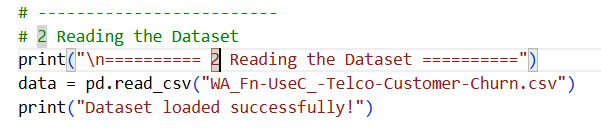

**Interpretation:** Converting from Excel to CSV makes it easier to manipulate the data using Pandas.

---

## 3 Checking Dataset Info

* Prints the dataset dimensions: 7043 rows and 21 columns (to check before and after cleaning)
* `data.info()` shows the type of each column, range, and object types
* 1 float column, 2 int64 columns, 18 text/mixed columns → 21 columns total
* Memory usage ~1.1MB
* `data.isnull().sum()` counts missing values → no missing values

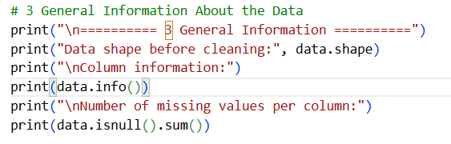

---

## 4 Cleaning TotalCharges

* Line 2 converts all values in `TotalCharges` to numeric (`errors='coerce'` → non-numeric values become NaN)
* Line 3 replaces all NaN with the average (mean), `inplace=True` modifies the existing column

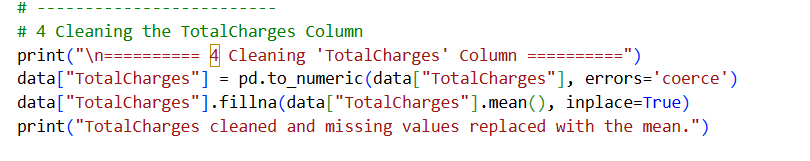

**Interpretation:** This ensures all numeric values are ready for analysis and plotting.

---

## 5 Removing Duplicate Rows

* Line 2 stores the number of rows before removing duplicates
* Line 3 removes duplicate rows
* Line 4 stores the number of rows after

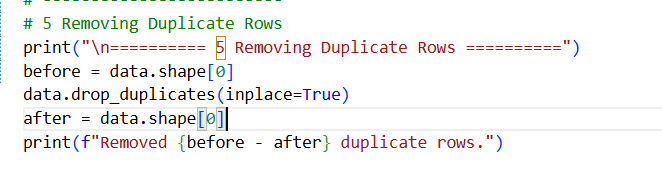

**Interpretation:** Removing duplicates ensures each row represents a unique customer.

---

## 6 Dropping customerID

* I will delete `customerId` because it won’t help in analysis and takes extra memory
* `axis=1` → remove column, not row

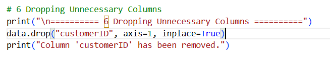

**Interpretation:** This column is just a unique identifier and does not contribute to the analysis.

---

## 7 Checking Data After Cleaning

* `data.shape` → dimensions after cleaning
* Line 3 counts missing values per column after cleaning
* Line 5 shows the first 5 rows after cleaning

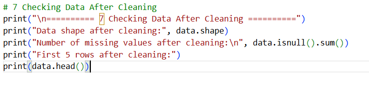

**Interpretation:** Confirms that the dataset is clean and ready for analysis.

---

## 8 Churn Distribution Chart

* Line 2 creates a new figure with size 6 inches × 4
* Line 3 creates a bar chart showing the `Churn` column
* `data=data` uses the cleaned dataset
* Line 5 displays the chart

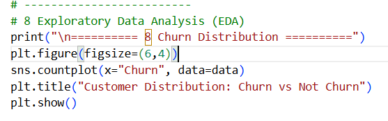

**Interpretation:** Shows the number of customers who churned vs those who stayed.

---

## 9 Box Plot: Tenure vs Churn

* Line 3 creates a box plot comparing tenure values for each churn group (`x=Churn`, `y=tenure`)
* Creates two boxes: one for customers who churned, one for customers who didn’t
* Line 4 adds a title

**Interpretation:** Shows the relationship between how long a customer stayed and their likelihood to churn.

---

## 10 Summary Statistics for Numeric Columns

* Line 3 generates summary statistics for numeric columns and displays the result

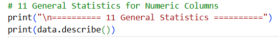

**Interpretation:** Gives an overview of averages, standard deviation, minimum and maximum values of numeric columns.

---

## 11 Churn Counts & Percentages

* Line 3 counts how many times each value appears in `Churn`
* Line 5 counts each value as before, but `normalize=True` converts counts to percentages

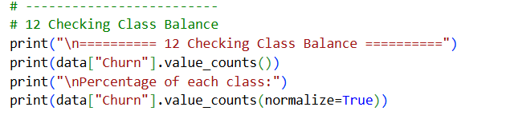

**Interpretation:** Helps us understand the class balance between customers who churned and those who stayed.

## and this is the results 

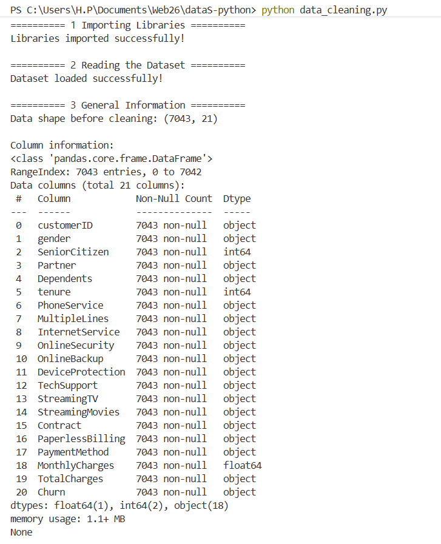
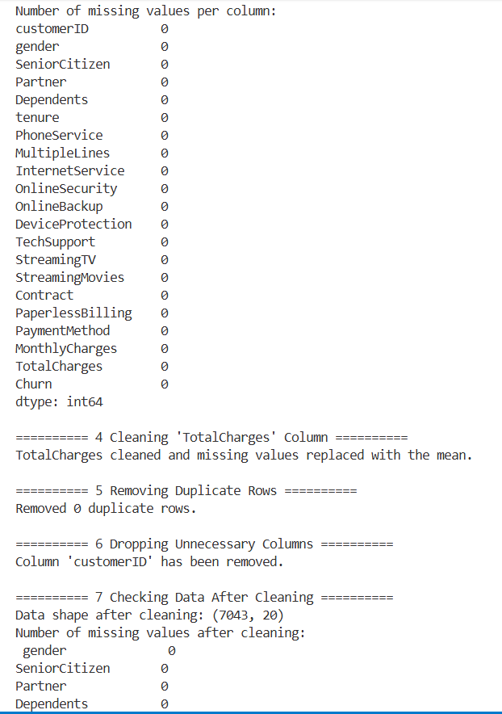
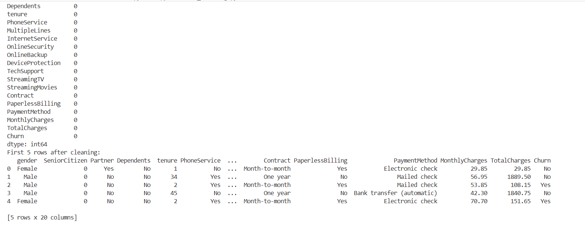
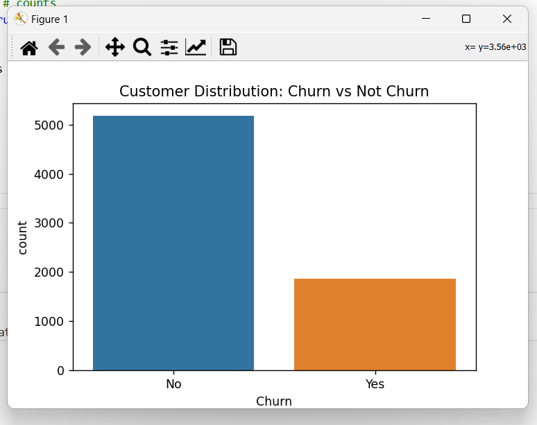
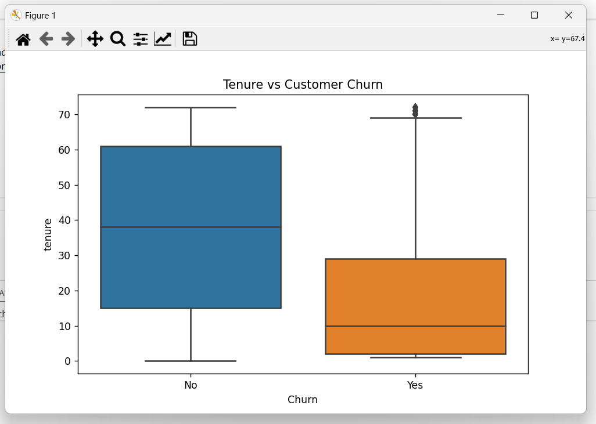
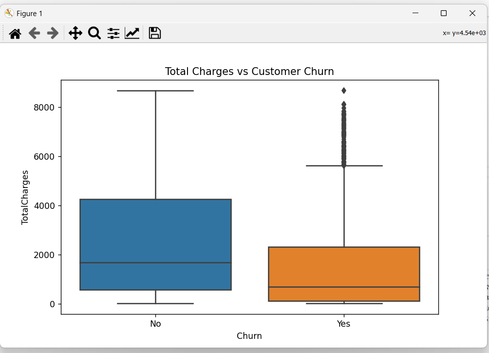
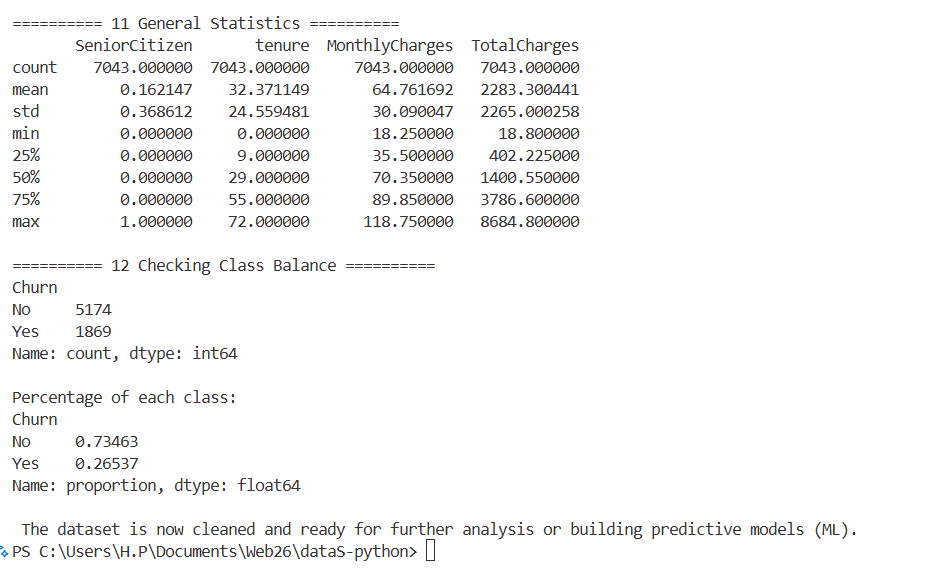

4️ Conclusions

Data is clean, with no missing values or duplicates.

Customers with shorter tenure are more likely to churn.

TotalCharges can help identify high-risk churn customers.

Churn class is slightly imbalanced → consider techniques for predictive modeling if needed.

Dataset is ready for further analysis or building predictive models (ML).